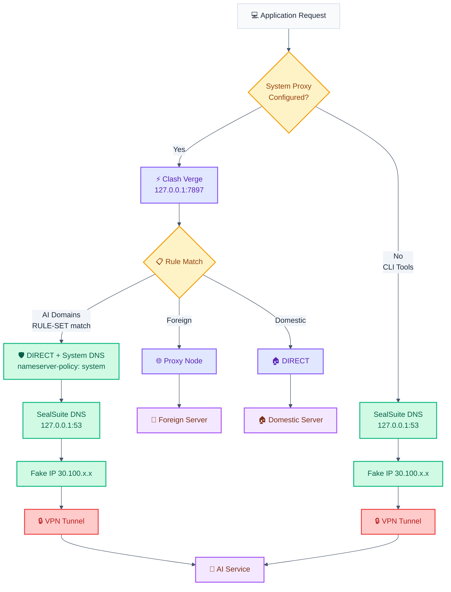

# SealSuite + Clash Verge Integration

Clash Verge (Mihomo) 与 SealSuite VPN 共存配置，使 AI 服务流量通过 SealSuite 企业 VPN 访问。

## Architecture



## What We Changed

Clash Verge → 订阅 → 全局扩展脚本（Script），添加以下配置：

### Script.js

```javascript
const prerules = [
  "RULE-SET,claude_code,DIRECT",
  "RULE-SET,google_gemini,DIRECT"
];

function main(config, profileName) {
  if (profileName === "tizi") {
    if (config["dns"]) {
      // Bypass fake-ip for AI domains — get real DNS from SealSuite
      if (!config["dns"]["fake-ip-filter"]) {
        config["dns"]["fake-ip-filter"] = [];
      }
      config["dns"]["fake-ip-filter"].push("rule-set:claude_code");
      config["dns"]["fake-ip-filter"].push("rule-set:google_gemini");

      // Use system DNS (SealSuite) for AI domain resolution
      if (!config["dns"]["nameserver-policy"]) {
        config["dns"]["nameserver-policy"] = {};
      }
      config["dns"]["nameserver-policy"]["rule-set:claude_code"] = ["system"];
      config["dns"]["nameserver-policy"]["rule-set:google_gemini"] = ["system"];
    }

    if (!config["rule-providers"]) {
      config["rule-providers"] = {};
    }
    config["rule-providers"]["claude_code"] = {
      "type": "http",
      "behavior": "domain",
      "format": "mrs",
      "interval": 86400,
      "path": "./rule_provider/claude_code.mrs",
      "url": "https://ghfast.top/github.com/MetaCubeX/meta-rules-dat/raw/refs/heads/meta/geo/geosite/anthropic.mrs"
    };
    config["rule-providers"]["google_gemini"] = {
      "type": "http",
      "behavior": "domain",
      "format": "mrs",
      "interval": 86400,
      "path": "./rule_provider/google_gemini.mrs",
      "url": "https://ghfast.top/github.com/MetaCubeX/meta-rules-dat/raw/refs/heads/meta/geo/geosite/google-gemini.mrs"
    };

    config["rules"] = prerules.concat(config["rules"] || []);
  }
  return config;
}
```

### Three Key Changes Explained

| Change | Purpose |
|--------|---------|
| `fake-ip-filter` 添加 AI rule-set | AI 域名跳过 Clash 的 fake-ip，获得真实 DNS 解析 |
| `nameserver-policy` 设为 `system` | AI 域名的 DNS 查询走系统 DNS（即 SealSuite 的 `127.0.0.1:53`），SealSuite 返回 fake IP（`30.100.x.x`）触发 VPN 路由 |
| `prerules` 设为 `DIRECT` | AI 流量不经过 Clash 代理节点，直连出去（由 SealSuite VPN 隧道承载） |

### Rule-Set Sources

域名列表由 [MetaCubeX/meta-rules-dat](https://github.com/MetaCubeX/meta-rules-dat) 维护，每日自动更新：

| Rule-Set | Source | Domains |
|----------|--------|---------|
| `claude_code` | `anthropic.mrs` | anthropic.com, claude.ai, claude.com, claudeusercontent.com, clau.de, claudemcpclient.com |
| `google_gemini` | `google-gemini.mrs` | gemini.google.com, generativelanguage.googleapis.com, aistudio.google.com, deepmind.com, notebooklm.google, jules.google, labs.google |

## CLI Tools

Claude Code、Gemini CLI 等终端工具**不需要配置代理环境变量**：

```bash
# 不设置 HTTPS_PROXY，流量自动走 SealSuite VPN
# App → SealSuite DNS → Fake IP → VPN Tunnel → AI Service
```

## Troubleshooting

```bash
# 检查 SealSuite VPN 接口
ifconfig | grep -E "^utun" -A 3 | grep -E "^utun|inet "

# 检查 SealSuite DNS
scutil --dns | head -10

# 检查路由表
netstat -rn | grep utun

# 测试直连 AI 服务（不走 Clash）
curl -x "" -sI --connect-timeout 10 https://api.openai.com
```
