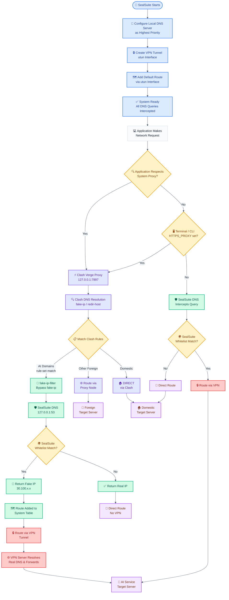

# How SealSuite Works with Clash Verge

This document explains the operational mechanism of SealSuite VPN and how it integrates with Clash Verge (Mihomo) on macOS.

## SealSuite + Clash Verge Workflow Diagram



## Flowchart Components Explained

### Setup Phase (Blue)
- **🚀 SealSuite Starts**: SealSuite application launch
- **🔧 Configure Local DNS Server**: Sets up `127.0.0.1:53` as the highest priority DNS server
- **🔒 Create VPN Tunnel**: Creates a `utun` interface (e.g., utun4, utun6 — dynamically assigned)
- **🗺️ Add Default Route**: Adds a default route via the utun interface to capture traffic
- **✅ System Ready**: All DNS queries are intercepted by SealSuite

### Decision Points (Yellow)
- **🔍 Application Respects System Proxy?**: Determines if the application honors system proxy settings (browsers do, most CLI tools don't)
- **📋 Match Clash Rules**: Clash Verge evaluates rules to determine routing — AI domains, foreign, or domestic
- **🌍 SealSuite Whitelist Match?**: SealSuite checks if the domain is in its enterprise whitelist
- **🖥️ Terminal / CLI HTTPS_PROXY set?**: CLI tools only go through Clash if `HTTPS_PROXY` is configured

### DNS Processing (Green)
- **🚫 fake-ip-filter Bypass**: AI domains added to `fake-ip-filter` skip fake-ip, get real DNS resolution
- **🛡️ SealSuite DNS**: Local DNS server (`127.0.0.1:53`) receives and processes the DNS request
- **🔀 Return Fake IP Address**: Provides a fake IP (`30.100.x.x` range) for whitelisted foreign domains
- **✅ Return Real IP Address**: Provides the actual IP for non-whitelisted domains
- **🗺️ Route Added to System Table**: Creates system-level routing rules for fake IPs

### Clash Verge Processing (Purple)
- **⚡ Clash Verge Proxy**: System proxy at `127.0.0.1:7897` (mixed-port)
- **🔍 Clash DNS Resolution**: Mihomo resolves DNS using configured nameservers
- **🌐 Route via Proxy Node**: Traffic routed through proxy nodes for foreign access
- **🏠 DIRECT via Clash**: Domestic traffic directly forwarded

### VPN Processing (Red)
- **🔒 Route via VPN Tunnel**: Directs traffic through the SealSuite VPN connection
- **🌐 VPN Server Resolves Real DNS**: VPN server performs actual DNS resolution for whitelisted domains

## SealSuite Core Workflow

### 1. DNS Server Setup

SealSuite starts a local DNS server on `127.0.0.1:53` and configures it as the highest priority DNS server in the system's network settings. This ensures all DNS queries from applications are intercepted by SealSuite's intelligent DNS resolver.

### 2. VPN Tunnel and Routing

SealSuite creates a `utun` interface (dynamically assigned, e.g., utun4 or utun6) and adds routes to the system routing table:
- A `default` route via the utun interface
- Specific routes for DNS servers (`1.1.1.1`, `8.8.8.8`) via the utun interface
- Enterprise internal network routes (`30.100.0.0/16`)

### 3. Intelligent DNS Response Logic

SealSuite analyzes each DNS query against its enterprise whitelist:

#### For Whitelisted Domains (e.g., AI Services):
- Returns a **fake IP address** from the `30.100.x.x` range
- The fake IP triggers VPN routing through the utun interface
- Real DNS resolution happens on the VPN server side

#### For Non-Whitelisted Domains:
- Returns the **real IP address** from standard DNS resolution
- Traffic routes directly without VPN involvement

## Integration with Clash Verge

### Architecture Overview

Clash Verge and SealSuite operate at different network layers:

| Component | Layer | Mechanism | Port |
|-----------|-------|-----------|------|
| Clash Verge | Application (L7) | HTTP/SOCKS System Proxy | 127.0.0.1:7897 |
| SealSuite | Network (L3) | VPN Tunnel (utun) + DNS | 127.0.0.1:53 |

### Traffic Flow by Application Type

#### Proxy-Aware Applications (Browsers, etc.)
1. Application sends request to Clash Verge system proxy (`127.0.0.1:7897`)
2. Clash Verge matches rules and determines routing:
   - **AI domains** → `DIRECT` (with `fake-ip-filter` + `nameserver-policy: system`)
   - **Foreign domains** → Proxy node
   - **Domestic domains** → `DIRECT`
3. For AI domains routed to `DIRECT`, Clash performs DNS via system DNS (SealSuite)
4. SealSuite returns fake IP → traffic routes through VPN tunnel

#### Non-Proxy Applications (CLI Tools like Claude Code, Gemini CLI)
1. Application connects directly (no `HTTPS_PROXY` set)
2. DNS query goes to SealSuite's local DNS server
3. SealSuite returns fake IP for whitelisted AI domains
4. Traffic routes through VPN tunnel automatically

### Clash Verge Script Configuration

The global extend script configures Clash Verge to cooperate with SealSuite:

```javascript
const prerules = [
  "RULE-SET,claude_code,DIRECT",
  "RULE-SET,google_gemini,DIRECT"
];

function main(config, profileName) {
  if (profileName === "tizi") {
    if (config["dns"]) {
      // Bypass fake-ip for AI domains — get real DNS from SealSuite
      if (!config["dns"]["fake-ip-filter"]) {
        config["dns"]["fake-ip-filter"] = [];
      }
      config["dns"]["fake-ip-filter"].push("rule-set:claude_code");
      config["dns"]["fake-ip-filter"].push("rule-set:google_gemini");

      // Use system DNS (SealSuite) for AI domain resolution
      if (!config["dns"]["nameserver-policy"]) {
        config["dns"]["nameserver-policy"] = {};
      }
      config["dns"]["nameserver-policy"]["rule-set:claude_code"] = ["system"];
      config["dns"]["nameserver-policy"]["rule-set:google_gemini"] = ["system"];
    }

    if (!config["rule-providers"]) {
      config["rule-providers"] = {};
    }
    config["rule-providers"]["claude_code"] = {
      "type": "http",
      "behavior": "domain",
      "format": "mrs",
      "interval": 86400,
      "path": "./rule_provider/claude_code.mrs",
      "url": "https://ghfast.top/github.com/MetaCubeX/meta-rules-dat/raw/refs/heads/meta/geo/geosite/anthropic.mrs"
    };
    config["rule-providers"]["google_gemini"] = {
      "type": "http",
      "behavior": "domain",
      "format": "mrs",
      "interval": 86400,
      "path": "./rule_provider/google_gemini.mrs",
      "url": "https://ghfast.top/github.com/MetaCubeX/meta-rules-dat/raw/refs/heads/meta/geo/geosite/google-gemini.mrs"
    };

    config["rules"] = prerules.concat(config["rules"] || []);
  }
  return config;
}
```

### Key Configuration Details

#### 1. fake-ip-filter

Adding AI domain rule-sets to `fake-ip-filter` ensures these domains bypass Clash's fake-ip mechanism and receive real DNS resolution from SealSuite:

```yaml
fake-ip-filter:
  - rule-set:claude_code
  - rule-set:google_gemini
```

#### 2. nameserver-policy

Configuring `nameserver-policy` with `system` DNS directs AI domain resolution to SealSuite's local DNS server (`127.0.0.1:53`):

```yaml
nameserver-policy:
  rule-set:claude_code:
    - system
  rule-set:google_gemini:
    - system
```

#### 3. Rule-Set Providers

Domain lists are maintained by [MetaCubeX/meta-rules-dat](https://github.com/MetaCubeX/meta-rules-dat) and auto-updated daily:

| Rule-Set | Source | Domains |
|----------|--------|---------|
| claude_code | `anthropic.mrs` | anthropic.com, claude.ai, claude.com, claudeusercontent.com, clau.de, claudemcpclient.com |
| google_gemini | `google-gemini.mrs` | gemini.google.com, generativelanguage.googleapis.com, aistudio.google.com, deepmind.com, notebooklm.google, jules.google, labs.google |

### CLI Tools Configuration

For terminal-based AI tools (Claude Code, Gemini CLI), **no proxy configuration is needed**:

```bash
# Do NOT set these for AI CLI tools:
# export HTTPS_PROXY=http://127.0.0.1:7897
# export HTTP_PROXY=http://127.0.0.1:7897

# Without proxy env vars, CLI traffic flows:
# App → System DNS (SealSuite) → Fake IP → VPN Tunnel → AI Service
```

## Technical Details

### SealSuite utun Interface

SealSuite creates a dynamically numbered utun interface on each launch:

```bash
# Check SealSuite's utun interface
$ ifconfig | grep -A 3 "utun.*inet "
utun4: flags=8051<UP,POINTOPOINT,RUNNING,MULTICAST> mtu 1280
    inet 100.64.49.x --> 100.64.49.x netmask 0xfffffc00
```

The interface number (utun4, utun6, etc.) may change after system restarts.

### Routing Table

SealSuite adds the following routes via its utun interface:

| Destination | Description |
|-------------|-------------|
| `default` | Default route — captures unmatched traffic |
| `1.1.1.1/32` | Cloudflare DNS via VPN |
| `8.8.8.8/32` | Google DNS via VPN |
| `30.100.0.0/16` | Enterprise internal network |
| `30.100.x.x` (dynamic) | Fake IPs for whitelisted foreign domains |

### DNS Resolution Chain

```
Application Request
    ↓
SealSuite Local DNS (127.0.0.1:53)
    ↓
┌─────────────────────────────────────┐
│  Whitelisted domain?                │
│  YES → Return fake IP (30.100.x.x) │
│  NO  → Return real IP              │
└─────────────────────────────────────┘
    ↓
Traffic routes based on IP:
  30.100.x.x → utun (VPN) → VPN server resolves real DNS
  Real IP    → Direct / Clash proxy
```

### Why This Architecture Works

1. **Layer Separation**: Clash Verge operates at the application proxy layer (L7), SealSuite operates at the network layer (L3). They don't conflict when properly configured.

2. **DNS Coordination**: By using `nameserver-policy: system` for AI domains, Clash delegates DNS resolution to SealSuite, which returns fake IPs to trigger VPN routing.

3. **fake-ip-filter**: Without this, Clash would return its own fake IPs (198.18.x.x range) for AI domains, bypassing SealSuite's DNS intelligence entirely.

4. **No Interface Binding Needed**: Unlike approaches that require `interface-name: utun6`, this solution works through DNS-level coordination and doesn't break when the utun interface number changes after reboot.

## Troubleshooting

### Verify SealSuite DNS is Active
```bash
scutil --dns | head -10
# Should show 127.0.0.1 on utun interface as resolver #1
```

### Verify SealSuite VPN Interface
```bash
ifconfig | grep -E "^utun" -A 3 | grep -E "^utun|inet "
# Look for the interface with 100.64.x.x IP
```

### Verify Routing Table
```bash
netstat -rn | grep utun
# Should show default route and 30.100.x.x entries
```

### Test Direct AI Access (No Proxy)
```bash
curl -x "" -sI --connect-timeout 10 https://api.openai.com
# Should return HTTP response if SealSuite routes correctly
```

### Check Clash Verge Logs
In Clash Verge → Connections panel, AI domain requests should show:
- Rule: `RuleSet/claude_code` or `RuleSet/google_gemini`
- Policy: `DIRECT`
